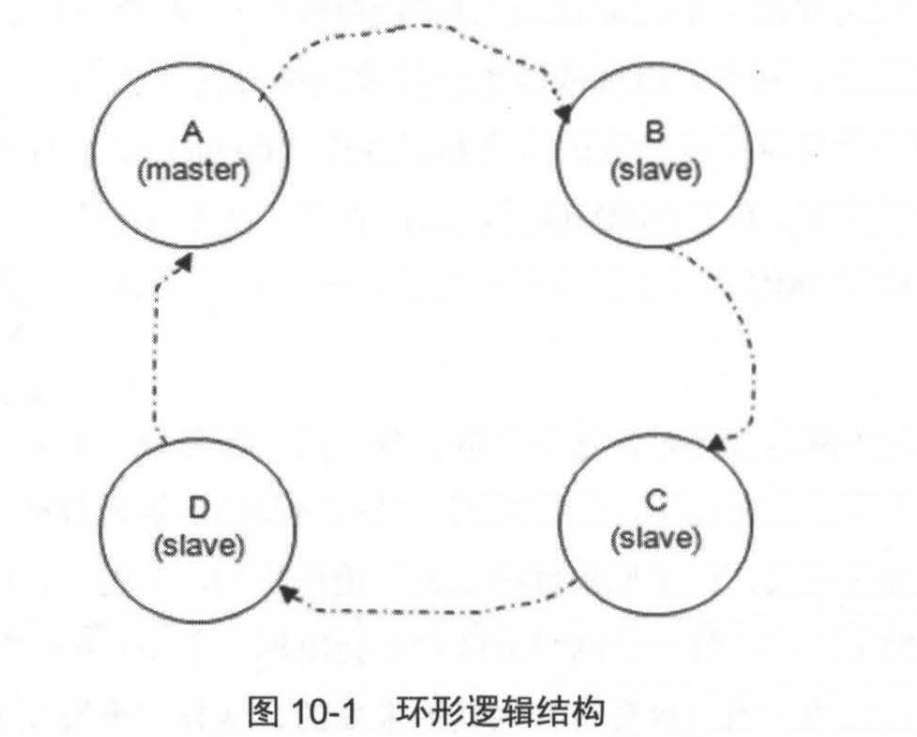

## 网络分区
　　网络分区可能会引起消息丢失或服务不可用等，可简单通过重启方式或配置自动化处理的方式来处理这个问题。但为什么会引起？

### 网络分区的意义
　　RabbitMQ 集群的网络分区的容错性不高，当出现网络分区时，不同分区里的节点会认为不属于自身所在分区的节点都已经挂了，对于队列、交换器、绑定的操作仅对当前分区有效。 
　　引入网络分区的原因，其中一个原因与 RabbitMQ 本身的数据一致性复制原理有关。上一章讲过，RabbitMQ 采用的镜像队列是一种环形的逻辑结构：
  

　　如上图，该队列配置了 4 个镜像，A 节点为 master 节点，其余为 slave 节点。如果要确认（ack）一条消息，会从 A 节点开始确认，然后到 B -> C -> D 节点。当 D 节点将执行操作返回给 A 节点时，这是真正确认一条消息。 
　　但这种一致性数据模型，如果遇到网络问题，使得某个节点，比如节点 B 出现网络异常，那么会导致整个 A -> B -> C -> D -> A 的数据链被阻塞，继而导致后续服务也会被阻塞。于是，为确保 RabbitMQ 服务的可用性，就需要使用网络分区将异常的节点从分区中剥离出来。 
　　大部分情况下，网络分区是由单个节点的网络故障引起的，会形成一个大分区和一个单节点的分区。

### 网络分区的判定
　　RabbitMQ 集群节点内部通信端口默认为 25672，两两节点之间都会有信息交互。当某节点因为网络问题，导致与其他节点的交互中断，会启用超时判定机制（默认超时为 60 秒），然后在网络分区。 
　　在 RabbitMQ 集群内部的每个节点之间会隔四分之一的 net_ticktime 计一次应答（tick），如果有任何数据被写入节点中，则此节点被认为已被应答。连续 4 次都没被 ticked，则会进行网络分区。
  
#### 查看网络分区方法

- 使用 rabbitmqctl cluster_status 命令，如果 partitions 项中有内容，则发生网络分区；
- 通过 Web 管理界面的方式查看；
- 通过 HTTP API 的方式调取节点信息来检测是否发生网络分区，比如通过 curl 命令查看 partitions 项中是否有内容。
