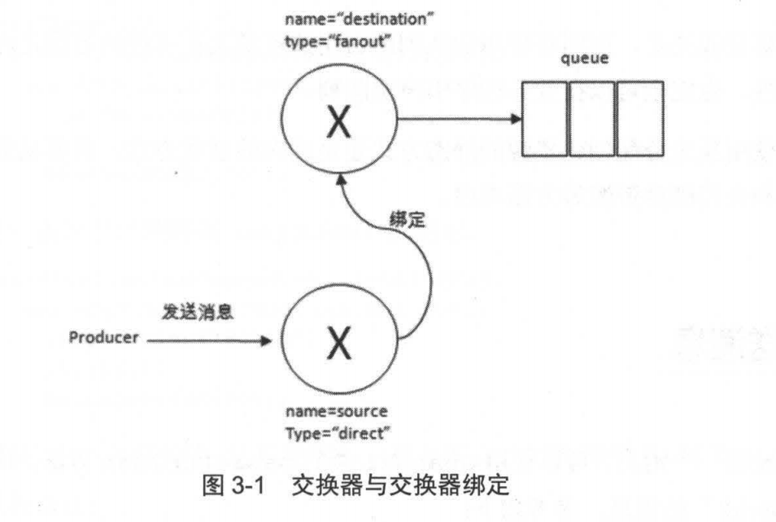

## 客户端开发向导
　　AMQP 协议层面的操作通过 Channel 接口实现，与 RabbitMQ 相关的开发工作，主要围绕 Connection 和 Channel 这两个类展开。

### 连接 RabbitMQ
　　有两种连接方法，一种给定参数，一种使用 URI。注意，Connection 可以用来创建多个 Channel 实例，但 Channel 实例不能在线程间共享，即应该一个线程一个 Channel，多线程间共享 Channel 实例是非线程安全的。 
　　不推荐使用 isOpen 来检测 Channel 是否关闭，而是通过捕获 ShutdownSignalException 异常来解决。

### 使用交换器和队列

- 使用 exchangeDeclare 或 queueDeclare 方法来声明队列。交换器和队列是 AMQP 中 high-level 层面的构建模块，应用程序需在使用前先声明（declare）它们。生产者和消费者都能够使用 queueDeclare 来声明一个队列，但是如果消费者在同一个信道上订阅了另一个队列，就无法再声明队列，需先取消订阅，然后将信道置为“传输”模式后，才能声明队列；
- 使用 queueBind 方法来将队列和交换器进行绑定；
- 使用 exchangeBind 方法将交换器和交换器进行绑定。生产者发送消息至交换器 source 中，交换器 source 根据路由键找到与其匹配的另一个交换器 destination，并把消息转发给 destination，进而存储在 destination 绑定的队列 queue 中。

### 何时创建
　　RabbitMQ 的消息存储在队列中，交换器的使用并不真正耗费服务器的性能，而队列会，要衡量 RabbitMQ 当前的 QPS 看队列即可。 
　　在实际业务应用中，需要对所创建的队列的流量、内存占用及网卡占用有一个清楚的认知，预估其平均值和峰值，以便在固定硬件资源的情况下进行合理分配。
  
### 发送消息
　　使用 Channel 类的 basicPublish 方法发送消息，如要设置消息属性，可使用 mandatory 参数。
  
### 消费消息
　　RabbitMQ 的消费模式分两种：
  
- 推（Push）模式使用 channel.basicConsume 进行消费。在推模式中，通过持续订阅的方式来消费信息。每个 Channel 都拥有自己独立的线程，最常见的是一个 Channel 对应一个消息者，意味着消费者之间没有任何关联，是线程安全的；
- 拉（Pull）模式使用 channel.basicGet 可单条获取消息，其返回值是 GetRespone。

### 消费端的确认与拒绝
　　消息确认机制，保证消息从队列可靠地到达消费者。
  
- 将 autoAck 设为 false，RabbitMQ 会等待消费者处理完业务后才从内存或磁盘中移去消息（实质上是先打上删除标记，之后再删除，与 Elasticsearch 的删除机制类似）；
- autoAck 为 true时，RabbitMQ 则自动把发送出去的消息设置为确认。

　　RabbitMQ 不会为未确认的消息设置过期时间，它判断此消息是否需要重新投递给消费者的唯一依据是消费该消息的消息者连接是否断开，断开则重新投递。 
　　消费者在收到消息后，想拒绝当前消息而不是确认，可使用 channel.basicReject 方法，它一次只能拒绝一条，批量拒绝使用 channel.basicNack 方法。
