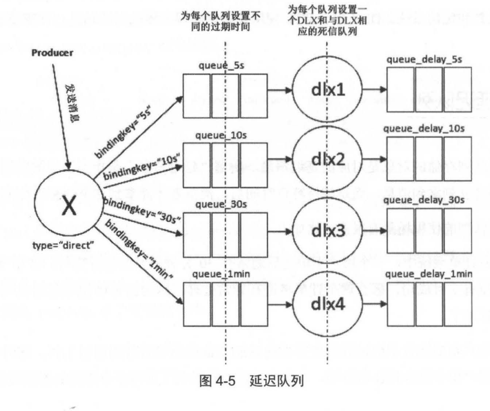

## RabbitMQ 进阶

### 消息何去何从
　　mandatory 和 immediate 是 channel.basicPublish 方法中的两个参数，都可以将消息发送失败不可到达时返回给生产者。而 RabbitMQ 提供的备份交换器则可以将未能被交换器路由的消息存储起来，不返回客户端。

- **mandatory 参数，为 true 时会调用 Basic.Return 命令将消息返回给生产者，false 则直接丢弃消息。**通过调用 channel.addReturnListener 来添加 ReturnListener 监听器实现，让生产者获取获取没有路由到队列的消息，如下监听器 ReturnListener 监听到 Basic.Return 返回的消息；

- **immediate 参数，为 true 时，如果该消息关联的队列上有消费者，则立刻投递。**如果所有匹配的队列上都没消费者，则直接将消息返还给生产者，不用将消息存入队列等待消费者。而 mandatory 参数不管队列上有没消费者，只要能匹配上就会存入队列中。

#### 备份交换器
　　设置 mandatory 参数，需要添加 ReturnListener 监听器来获取返回的消息，生产者代码变得复杂。换种方式，使用备份交换器，将返回的消息存储在 RabbitMQ 中，需要时在处理。 
　　备份交换器可通过在声明交换器（调用 channel.exchangeDeclare 方法）的时候添加 alternate-exchange 参数来实现，也可通过策略方式实现。
  

　　备份交换器的几种特殊情况：
  
- 如果设置的备份交换器不存在、备份交换器没有绑定或匹配任何队列，客户端和 RabbitMQ 服务端都不会有异常出现，此时消息会丢失；
- 如果备份交换器和 mandatory 参数一起使用，那么 mandatory 参数无效。

### 过期时间（TTL）

- 设置消息的 TTL。两种方法，一种通过队列属性设置，队列中所有消息都有相同过期时间。第二种是对消息本身单独设置，每条消息的 TTL 不同。如果两种方法一起使用，以消息的 TTL 最小的为准，TTL 不设置，则此消息不会过期。设为 0，则除非此时可以直接将消息投递到消费者，否则会被丢弃；
- 设置队列的 TTL。当队列上没有任何消费者，队列也没有被重新声明，并且在过期时间段内没调用过 Basic.Get 命令，则到达 TTL 时会删除该队列。如果 RabbitMQ 重启，则持久化队列的过期时间会重新计算。

### 死信队列
　　消息在队列中的生产时间超过 TTL 值时，就会变成“死信”，消费者将无法再收到该消息，这不是绝对的。 
　　当消息在一个队列中变成死信后，它能被重新发送到另一个交换器中，即死信交换器 DLX，绑定 DLX 的队列称为死信队列。当处理异常情况时，消息不能够被消费者正常消费而放入死信队列中，通过消费这个死信队列的内容来分析当时遇到的异常情况。 
　　消息变成死信的几种情况：
  
- 消息被拒绝，并且设置 requeue 参数为 false；
- 消息过期；
- 队列达到最大长度，放不下新消息。

　　上图过程，生产者发送一条携带路由键为 “rk”的消息，经过交换器 exchange.normal 顺利存储到队列 queue.normal 中。由于队列 queue.normal 设置过期时间为 10s，在这 10s 内没有消费者消费这条消息，所以该消息过期，被丢给死信交换器 exchange.dlx 中，找到与 exchange.dlx 匹配的死信队列 queue.dlx 并存储。

### 延迟队列
　　延长队列存储的是延迟消息，当消息被发送以后，需要等待指定时间，消费者才能拿到这个消息进行消费，使用场景有很多，比如：
  
- 在订单系统中，一个用户下单后通常有 30 分钟的时间进行支付，如果 30 分钟内没有支付成功，这个订单将进行异常处理，这是可用延迟队列来处理这些订单；
- 通过手机远程遥控家里的智能设备在指定的时间进行工作，这时可将用户指令发送到延迟队列，当指令设定的时间到了再将指令推送到智能设备。

　　死信队列可作为延迟队列，假设要获取延迟 10 秒的消息。首先正常队列的过期时间设为 10 秒，过期后该消息会存入死信队列，在从死信队列中获取延迟 10 秒后的信息。
  

### 优先级队列
　　具有高优先级的队列就有高的优先权，即优先级高的消息会被优先消费，通过设置队列的 x-max-priority 参数来实现。 
　　消息的优先级为 5，默认最低为 0。优先消费的前提是在消费堆积的情况下。如果消息没有堆积，且消费者的消费速度大于生产者的速度，就不需要优先消费。这点与线程优先级类似，只有当线程不够用时，才会用到优先级。

### RPC 实现
　　RPC（Remote Procedure Call），远程过程调用，是一种通过网络从远程计算机上请求服务。 
　　假设有两台服务器 A 和 B，一个应用部署在 A 服务器上，想要调用 B 服务器上应用提供的函数或方法。由于不在同一个内存空间，不能直接调用，需要通过网络来表达调用的语义和传达调用的数据。 
　　在 RabbitMQ 中进行 RPC 是很简单的，客户端发送请求消息，服务端回复响应的消息。为了接收响应的消息，需要在请求消息中发送一个回调队列。
  

#### RPC 的处理流程：
  
- 当客户端启动时，创建一个匿名的回调队列（名称由 RabbitMQ 自动创建，这里回调队列为 amq.gen-LhQzlgv3GhDOv8PIDabOXA）；
- 客户端为 RPC 请求设置 2 个属性，replyTo 用来告知 RPC 服务端回复请求时的目的队列，即回调队列，correlationId 用来标记一个请求；
- 请求被发送到 rpc_queue 队列中；
- RPC 服务端监听 rpc_queue 队列中的请求，当请求到来时，服务端会处理并且把带有结果的消息发送给客户端，接收的队列就是 replyTo 设定的回调队列；
- 客户单监听回调队列，当有消息时，检查 correlationId 属性，如果与请求匹配，就是结果。

### 持久化

- 交换器的持久化，在声明队列时将 durable 参数设置为 true 来实现。交换器不设置持久化的话，在 RabbitMQ 服务重启后，相关的交换器元数据会丢失，但消息不会丢失，只是不能将消息发送到这个交换器中，需要重新设置；
- 队列的持久化，在声明队列时将 durable 参数设置为 true 来实现。不设置持久化的话，服务重启后，相关队列的元数据会丢失，数据也会丢失；
- 消息的持久化。单单只设置队列持久化，重启后消息会丢失。单单只设置消息的持久化，重启后队列消失，导致消息也丢失，所以要同时设置队列的和消息的持久化。

#### 设置持久化，并不保证消息不会丢失
  
- 订阅消息队列时将 autoAck 参数设置为 true，接收到相关消息后即确认，但这时如果没来得及处理，服务器宕机，数据就会丢失。解决方法是将 autoAck 参数设为 false，业务处理完后手动确认；
- 将持久化的消息正确存入 RabbitMQ 时，还需一段时间才能存入磁盘中。RabbitMQ 并不会为每条信息都同步到磁盘中，可能是保存在缓存中。这时宕机的话，消息就会丢失。解决方法是引入 RabbitMQ 的镜像队列机制，相当于设置副本。如果主节点（master）挂掉，可自动切换到从节点（slave），保证高可用性。

### 生产者确认
　　默认情况下生产者是不知道消息有没正确地到达服务器，因为发送消息的操作是不会返回任何信息给生产者的，有两种解决方法：
  
- **通过事务机制实现。**channel.txSelect 将当前信道设置成事务模式，使用 channel.txCommit 来提交事务。如果事务提交成功，则消息一定到达了 RabbitMQ 中，如果提交不成功，则会使用 channel.txRollback 进行回滚。事务机制在一条消息发送后会使发送端阻塞，等待 RabbitMQ 回应后，才发送下一条信息。串行处理，很耗性能；
- **通过发送方确认机制实现。**生产者将信道设置成 confirm（确认）模式，所有在该信道上面发布的消息都会被指派一个唯一的 ID（从 1 开始），当消息投递到队列后，RabbitMQ 会发送一个确认（Basic.Ack）给生产者（包含消息的唯一 ID），这样生产者就知道消息已经到达队列。发送方确认机制是异步的，这点与事务机制不同，它可以在等待返回确认消息的同时继续发送下一条消息。

#### 改进发送方确认机制的使用方式
　　利用发送消息后不需要同步确认的优势：

- 批量 confirm 方法，每发送一批消息后，调用 channel.waitForConfirms 方法，等待服务器的确认返回。出现异常或超时问题，这批消息就要全部重发，导致重发发送相同的消息；
- 异步 confirm 方法，提供一个回调方法，服务端确认了一条或多条消息后客户端会回调这个方法进行处理。

### 消费端要点介绍

- **消费分发。**当 RabbitMQ 队列拥有多个消费者时，队列收到的消息将以轮询的分发方式发送给消费者。每条消息只会发送给订阅列表里的一个消费者，可通过创建更多消费者来消息处理消息，易于扩展。轮询存在问题，比如由于业务原因，有些消费者处理的消息耗时，而有些很快处理完，造成线程空闲。所以 RabbitMQ 会保存一个消费者列表，发送一条消息，对应的消费者技术加一，消费者返回确认处理完后的消息，则计数减一。一旦达到上限，Rabbit 就不会向这个消费者发送消息，这种机制类似于  TCP / IP 中的“滑动窗口”；
- **消息顺序性。**消息的顺序性是指消费者消费到的消息和发送者发布的消息顺序一致，比如生产者发的消息为 msg1、msg2、msg3，消费者也按照 msg1、msg2、msg3 顺序消费，但 RabbitMQ 不一定能保证顺序性，比如以下几种常见情形，要保证消息的顺序性，可在消息体内添加全局有序标识；
    1. 生产者发送消息异常需重发消息，这时重发是使用另一个线程实现，导致顺序乱了；
    2. 生产者发送的消息设置了不同延时时间，收到的消息顺序不一致；
    3. 消息设置了优先级。

 - **弃用 QueueingConsumer。**会导致内存溢出问题。

### 消息传输保障
　　一般消息中间件的消息传输保障分为三个层级：
  
- 最多一次，消息可能会丢失，但绝不会重复传输。因很难保证消息不会丢失，不建议使用；
- 最少一次，消息绝不会丢失，但可能会重复传输；
    1. 使用事务机制或发送方确认机制保证消息传输到 RabbitMQ 中；
    2. 消息生产者配合使用 mandatory 参数或备份交换器确保消息能够从交换器路由队列中，进而保存起来不会被丢弃；
    3. 消息和队列进行持久化处理；
    4. 将 autoAck 设为 false，手动确认消息。
- 恰好一次，每条消息肯定会被传输一次且仅传输一次。大多数主流消息中间件都无法保证，比较复杂。
