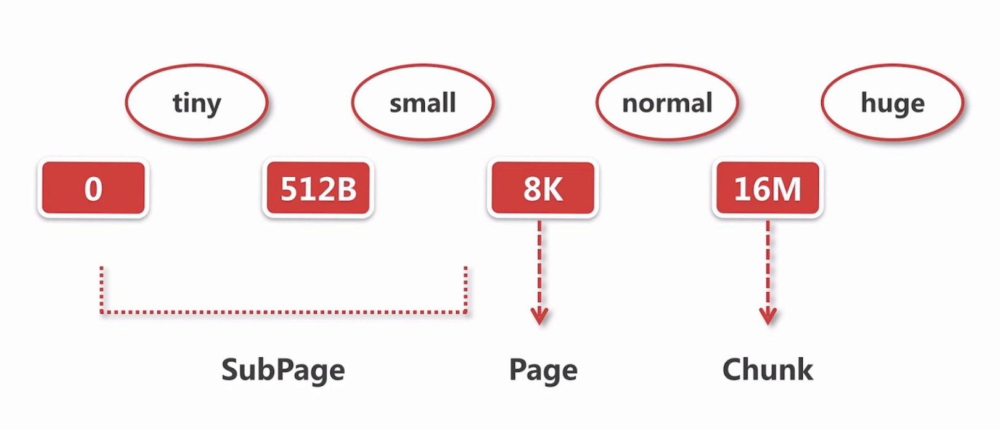

## 内存规格介绍
　　
- **16M，为 Chunk。** 所有的内存申请是通过以 Chunk 为单位向操作系统进行申请的，后续的所有内存分配都是在 Chunk 里做对应操作，比如要分配 1M 内存，需申请 16M 的 Chunk。然后在 16M 里去取一段内存当做 1M，把这 1M 的连续内存放到 ByteBuf 里；
- **8K，为 Page。** 将 16M 内存以 Page（8K）进行切分，可切分 2^11 个 Page，即 2048 个 Page，比如分配 16K 内存时，只需找到 2 个 Page，而且 Page 是连续的，这样分配高效；
- **0~8K，为 SubPage。** 比如要分配 1K 内存，则对 8K 的 Page 进行切分，分成 8 份，每次要取 1K 时，则在这个 Page 获取。同样如果要分配 512 个字节时，也是将一个 Page 进行切分，下次要在获取 512 个字节，则从这里获取。

- 0 ~ 512B，为 tiny；
- 512B ~ 8K，为 small；
- 8K ~ 16M，为 normal；
- 大于 16M，为 huge。
