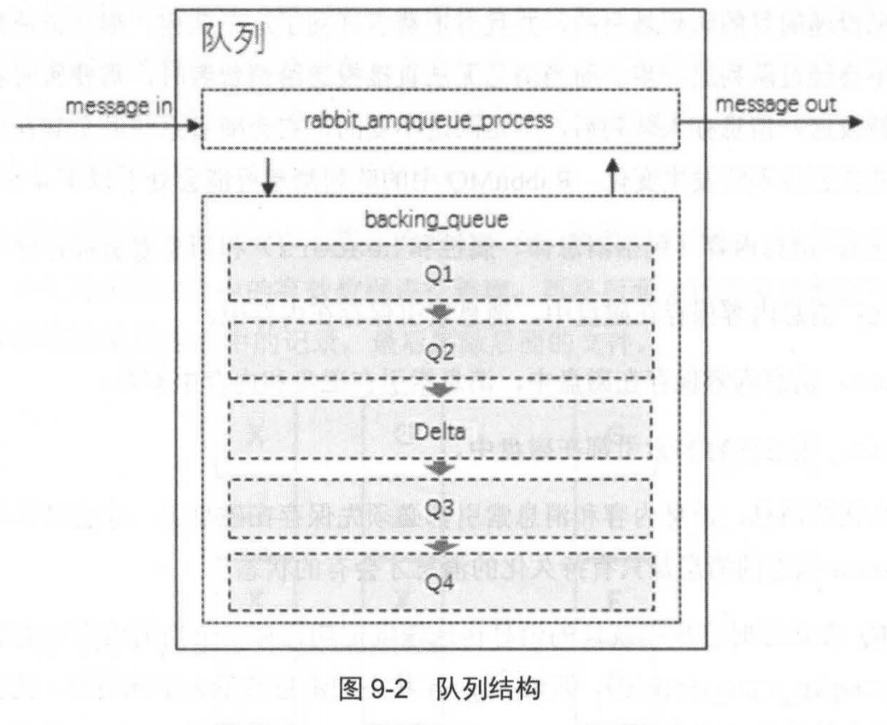

## 存储机制
　　消息分为持久化和非持久化，持久化会写入磁盘，但在内存中也会保存一份，提高性能，非持久化则保存在内存中，这两种类型的消息的落盘（持久化到磁盘中）处理都在 RabbitMQ 的“持久层”中完成。 
　　持久化层是一个逻辑上的概念，包含两部分：
  
- **队列索引，存储消息索引。**负责维护队列中落盘消息的消息，包括消息的存储地点、是否已被交付给消费者、是否已被消费者 ack（确认） 等，每个队列都有一个队列索引；
- **消息存储，存储消息内容。**以键值对的形式存储消息，被所有队列共享，在每个队列上有且只有一个。

　　队列索引存储较小的消息，而消息索引存储较大的消息，可通过 queue_index_embed_mgs_below 来配置，消息包含消息体、属性及 headers 整体。
  
### 队列索引（rabbit_queue_index）
　　rabbit_queue_index 以顺序（文件名从 0 开始累加）的段文件来进行存储，后缀为 ".idx"，每个段文件中包含固定的 SEGMENT_ENTRY_COUNT（默认为 16384） 条记录，每个队列索引从磁盘中读取消息时至少要在内存中维护一个段文件，设置 queue_index_embed_mgs_below 值要小心，一点点增大可能会引起内存爆炸。
  
### 消息存储（rabbit_msg_store）
　　经过消息存储处理的所有消息都以追加的方式写入到文件中，文件名是从 0 开始累加，最小的即为最老的文件。读取消息时，是根据消息的 ID 找到对应存储的文件。 
　　对消息进行删除，是先将消息标记为垃圾，当一个文件都是标记为垃圾的消息时才将文件删除（原理同 JVM 的 GC 时使用的标记清除算法类似）。另一种情况是，检测到前后两个文件中的有效数据可合并在一个文件，则删除垃圾消息并合并。
  
### 队列的结构
　　由以下两部分组成：
  
- rabbit_amqqueue_process，负责协议相关的消息处理，即接收生产者发布的消息、向消费者交付消息、处理消息的确认（包括生产端的 confirm 和消费端的 ack）等
- backing_queue，消息存储的具体形式和引擎，向 rabbit_amqqueue_process 提供相关接口以供调用。

### 队列消息状态

- alpha，消息内容（包括消息体、属性和 headers）和消息索引都存储在内存中。最耗内存，但很少消耗 CPU，内存不够时会转为其他状态。；
- beta，消息内容保存在磁盘中，消息索引保存在内存中；
- gamma，消息内容保存在磁盘中，消息索引在磁盘和内存中都有；
- delta，消息内容和索引都在磁盘中。基本不消耗内存，但消耗更多的 CPU 和磁盘 I / O 操作，需要执行两次 I / O 操作，分别读取消息索引（从 rabbit_queue_index）和读取消息内容（rabbit_msg_store）。

　　RabbitMQ 在运行时会根据统计的消息传送速度定期计算一个当前内存中能够保存的最大消息数量，超过 alpha 所能保存的（内存不足），则会将消息转为其他状态。

### backing_queue
　　在没有设置优先级和镜像的队列时，backing_queue 的默认实现是 rabbit_variable_queue，其内部通过 5 个子队列 Q1、Q2、Delta、Q3 和 Q4 来体现消息的各个状态。整个队列包括 rabbit_amqqueue_process 和 backing_queue 的各个自队列，如下图：
  

- Q1、Q4 只包含 alpha 状态的消息，Q2 和 Q3 包含 beta 和 gamma 状态的消息，Delta 只包含 delta 状态的消息；
- 消息按照 Q1 -> Q2 -> Delta -> Q3 -> Q4 顺序流动，但并不是绝对的，取决于当前系统的负载状态（内存消耗等，负载高，将部分消息保存在磁盘）；
- 消费者获取消息也会引起消息在状态转换，先从 Q4 获取，为空则从 Q3 获取，如果 Q3 为空，则返回队列为空，即此时队列中无消息。因为当 Q3 为空，Delta 不为空时，会将消息转移到 Q3。如果 Delta 为空，Q2 不为空，会将 Q2 消息转移到 Q3。Delta 为空，Q2 也为空，但 Q1 不为空时，会将消息转移到 Q4；
- durable 设为 true 的消息，会进入 gamma 状态，在开启发送者确认机制时，消息只有到了 gamma 状态时才会确认该消息已被接收。

### 惰性队列
　　默认情况下，消息是存在内存中，即使是持久化的消息，也在内存中留一份备份。惰性队列是为了支持更多的消息存储，而将消息存入磁盘中，在消费者消费相应的消息时才会被加载到内存中。 
　　当 RabbitMQ 需要释放内存时，会将内存中的消息存到磁盘中，这个耗时比较长，且会阻塞队列，导致无法接收新的消息。惰性队列会将接收到的消息存入文件系统中，减少内存消耗，但会增加 I / O  的使用。注意存储的是非持久化消息时，重启后消息会丢失。 
  　　惰性队列和普通队列相比，只有很小的内存开销，比如普通队列发送消息消耗 1.2G 内存，则惰性队列只消耗 1.5M 内存。发送一千万条消息时，普通队列需 801 秒，惰性队列为 421 秒。因为普通队列由于内存不足而将消息存储至磁盘，这个操作耗时大。
