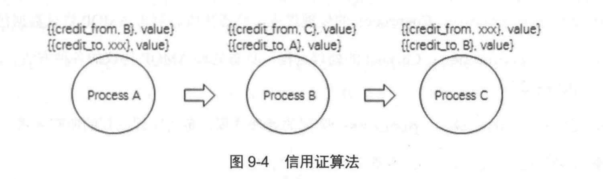
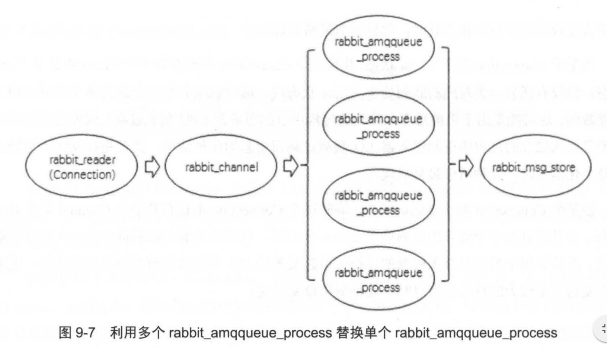
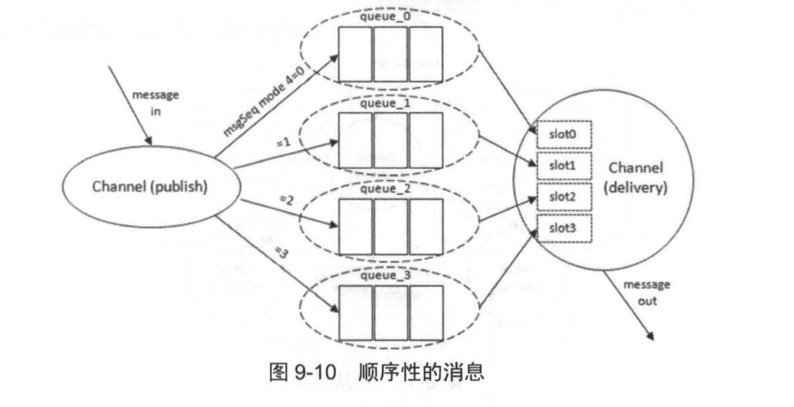

## 流控
　　流控机制是用来避免消息的发送速率过快而消费者消费速度较慢，导致服务器难以支撑的情形，内存和磁盘告警相当于全局的流控，会阻塞集群中所有的连接，而流控机制是针对单个连接的。（类似的思想，还存在于 TCP/IP 协议的滑动窗口中） 
　　RabbitMQ 使用一种基于信用证算法的流控机制来限制发送速率，通过监控各个进程的进程邮箱。当某个进程负载过高而来不及处理消息时，这个进程的进程邮箱会开始堆积消息。当堆积到一定量时，就会阻塞不接收上游信息。然后，上游进程的进程邮箱也会堆积，以类类推，最后使负责网络数据包接收的进程阻塞而暂停接收新数据。 
　　举例，进程 A 接收消息并转发给进程 B，进程 B 接收消息并转发给进程 C，每个进程中都有一对关于收发消息的 credit 值。
  
- 以进程 B 为例，{{credit_from, c}, value} ，每发送一条消息该值减一。当 为 0 时，进程 B 不再往进程 C 发送消息也不再接收进程 A 的消息；
- {{credit_to, A}, value} 表示再接收多少条信息就向进程 A 发送增加 credit 值的通知，进程 A 接收到该通知后就增加 {{credit_from, B}, value} 所对应的值，这样进程 A 就能持续发送消息；
- 当上游发送速率高于下游接收速率时，credit 值会被逐渐耗光，进程就会被阻塞，阻塞情况会一直传递到最上游；
- 当上游进程收到来自下游进程的增加 credit 值的通知时，若此时上游进程处于阻塞状态且解除阻塞，开始接收更上游进程的消息，一个一个传导最终解除最上游的阻塞状态。

　　一个连接（Connection）触发流控时会处于“flow”的状态，意味着这个 Connection 的状态每秒在 blocked 和 unblocked 之间来回切换数次，可将消息发送的速率控制在服务器能够支撑的范围内。 
　　流控机制不只是作用 Connection，同样作用于信道（Channel）和队列。从 Connection 到 Channel，再到队列，最后是消息持久化存储形成一个完整的流控链。当某个进程达到性能瓶颈时，必然会导致上游的所有进程被阻塞，可利用流控机制的特点找出瓶颈地方。
  

　　处理消息的几个关键进程如上：
  
- rabbit_reader，Connection 的处理进程，负责接收、解析 AMQP 协议数据包等；
- rabbit_channel，Channel 的处理进程，负责处理 AMQP 协议的各种方法、进行路由解析等；
- rabbit_amqqueue_process，队列的处理进程，负责实现队列的所有逻辑；
- rabbit_msg_store，负责实现消息的持久化。

### 瓶颈分析

- 当某个 Connection 处于 flow（流控） 状态，但这个 Connection 没有一个 Channel 处于 flow 状态，表示有一个或多个 Channel 出现性能瓶颈，导致上游 Connection 在阻塞或被阻塞之间来回切换（进入 flow）；
- 同理，可得 Connection 处于 flow，Channel 处于 flow，但队列没，则队列出现性能瓶颈，导致上游进行 flow。

### 提升队列性能

- 开启 Erlang 语言的 HiPE 功能；
- 使用多个 rabbit_amqueue_process 替换单个 rabbit_amqueue_process，即使用多队列，可充分利用上 rabbit_reader 或 rabbit_channel 进程中被流控的性能。将交换器、队列、绑定关系、生产和消费的方法全部进行封装，对于应用来说就好比在操作一个（逻辑）队列。比如逻辑队列中有四个队列，分为 q1、q2、q3、q4，假定发送消息封装函数为 sendMessage()，于是封装号后，使用随机函数来选择一个队列发送，如 sendMessage(q2)、sendMessage(q3)。

　　如果应用要求消息要有一定的顺序性，可使用下列方法。
  
- 发送端根据 Message 的消息序号 msgSeq 对分片个数进行取模运算，之后将对应的消息发送到对应的队列中，这样消息可均匀且顺序地存储在每个队列中；
- 在消费端为每个队列创建一个消费槽（slot），从队列中读取的消息存入对应的槽中，发送到下游的消息可依次从 slot0 至 slot3 进行读取。

