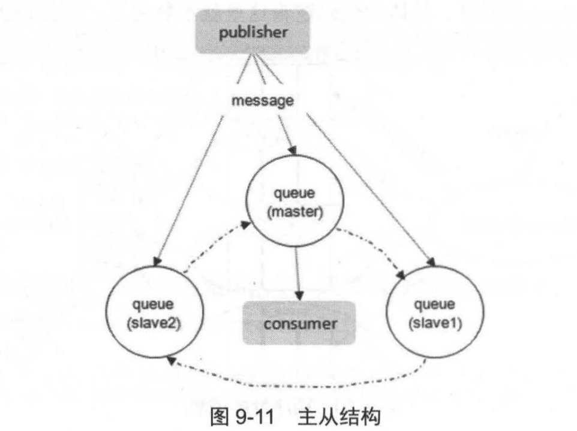
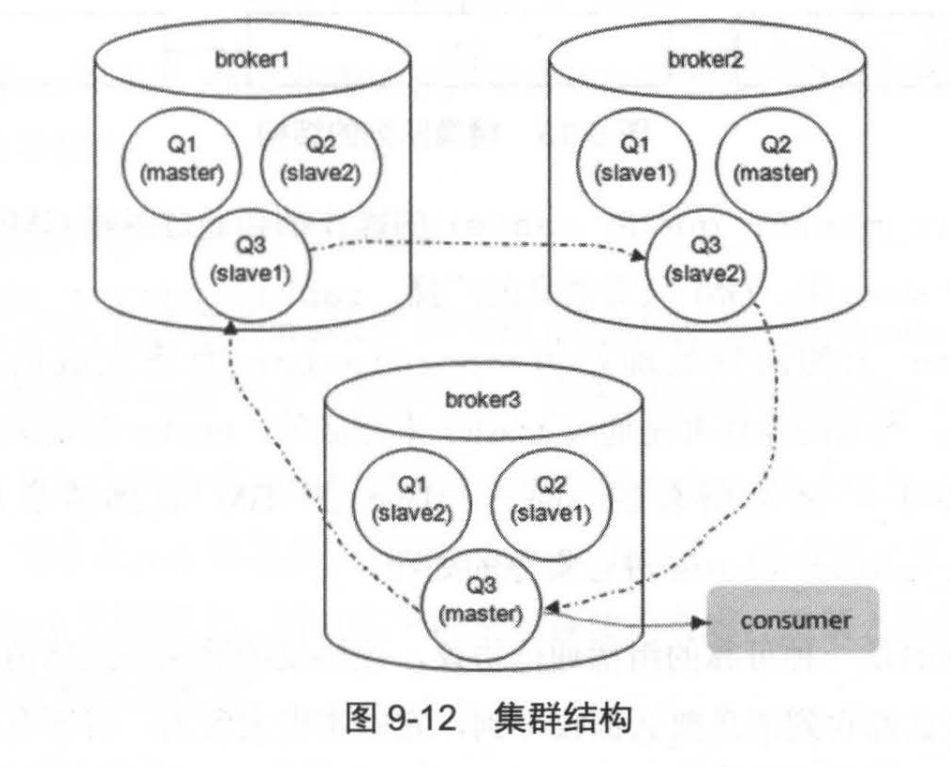
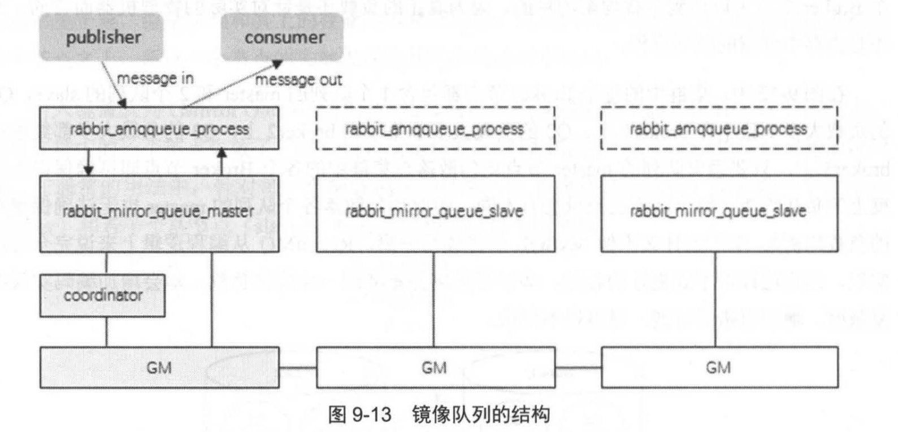
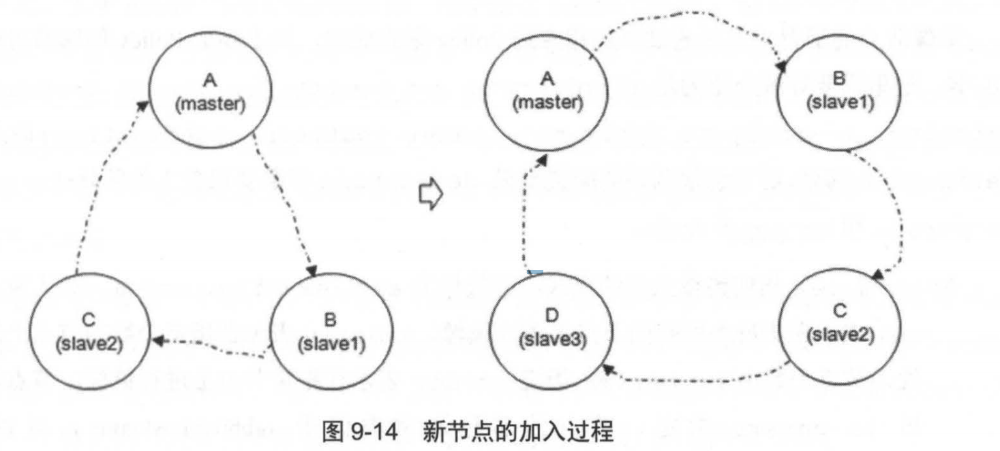

## 镜像队列
　　用于保证高可用，如果集群中的一个节点失效，队列能自动切换到镜像中的另外一个节点保证服务的可用性。如下图，每一个镜像队列包含一个主节点和若干从节点：
  

- 发送到镜像队列的所有消息会被同时发往 master 和所有的 slave 上；
- 除了发送消息外的其它动作，只会发给 master，由 master 将命令执行的结果广播给各个 slave；
- 当 master 出问题失效时，资历最老（加入时间最长的 slave，因为最老的 slave 与旧的 master 之间的同步状态应是最好的，即保存的消息是最多的）会被提升为新的 master；

　　如果消费者与 slave 建立连接并进行订阅消息，看似从 slave 上消费，其实质都是从 master 上获取消息。不像 MySql，master 写而 slave  读。但这么多的读写压力落到 master 上，并不会造成不均衡。 
　　因为这里的 master 和 slave 是针对队列而言的，而队列可均匀地散落在集群的各个 broker 节点中达到负载均衡的目的，因为真正的负载是针对实际的物理机器而言的，而不是内存中驻留的队列进程。即负载是指多个 broker 进行负载均衡，而不是单个 broker 的 master 和 slave 负载。

　　RabbitMQ 不像 MySql 进行读写分离，是因为不能进一步优化负载，却会增加编码实现的复杂度。如下图，集群中的每个 Broker 节点都包含 1 个队列的 master 和 2 个队列的 slave。 
　　同样的，RabbitMQ 的镜像队列支持 publisher confirm 和事务两种机制。只有当前事务在全部镜像中执行完毕之后，才会收到确认消息。

#### 镜像队列的结构
　　不同于普通的非镜像队列（上面的图 9-2），镜像队列的 backing_queue 比较特殊，其实现并非是 rabbit_variable_queue，它内部包裹了普通 backing_queue 进行本地消息的持久化处理，在此基础上增加了将消息和 ack 复制到所有镜像的功能。 
　　镜像队列的结构如下图，master 的 backing_queue 采用的是 rabbit_mirror_queue_master，而 slave 的是 rabbit_mirror_queue_slave。
  

　　除发送消息外的其余操作都是先发给 master，在由 master 通过组播 GM 的方式同步到各个 slave 中。GM 负责消息的广播，slave 的 GM 收到消息后，通过回调交由 rabbit_mirror_queue_slave 进行实际的处理。 
　　
#### GM 模块
　　GM 模块实现的是一种可靠的组播通信协议，能保证组播消息的原子性，即保证组中活着的节点要么都收到消息要么都收不到。实现方式：

- 将所有的节点形成一个循环链表，每个节点都会监控位于自己左右两边的节点，当有节点新增时，相邻的节点保证当前广播的消息会复制到新的节点上；
- 当有节点失效时，相邻的节点会接管以保证本次广播的消息会复制到所有的节点；
- 在 master 和 slave 上的这些 GM 形成一个组，这个组的消息会记录在 Mnesia 中，不同的镜像队列进程不同的组；

　　**master 如何知道命令已同步完成？**
>操作命令从 master 对应的 GM 发出后，顺着链表传送到所有的节点。由于所有节点组成一个循环链表，master 对应的 GM 最终会收到自己发送的操作命令，这时 master 就知道操作命令同步到了所有的 slave 上。

　　**新节点的加入过程如下**
>加入过程就是在链表中间插入一个节点（与 Netty 中的 pipeline 类似，也是将节点加入一个逻辑处理的链表中）。注意每当一个节点加入或重新加入到这个镜像链路中时，之前队列保存的内容会被全部清空。

　　当 slave 挂掉后，除了与 slave 相连的客户端连接全部断开外，没其他影响。而 master 挂掉，则会有连锁反应：
  
- 与 master 连接的客户端连接全部断开；
- 选择最老的 slave 作为新的 master，如果此时所有的 slave 处于未同步状态，则未同步的消息会丢失；
- 新的 master 重新入队所有未确认 unack 的消息，因为新的 slave 无法区分这些 unack 的消息是否已到达客户端，或是 ack 信息丢失在老的 master 链路上，再或者是丢失在捞的 master 组播 ack 消息到所有 slave 的链路上。所以处于消息可靠性的考虑，重新入队所有 unack 的消息，此时客户端可能会有重复消息；
